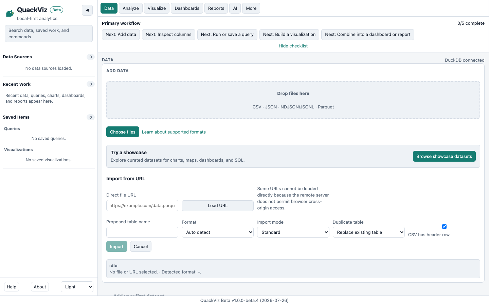
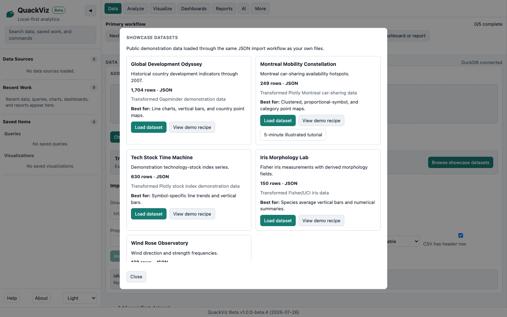
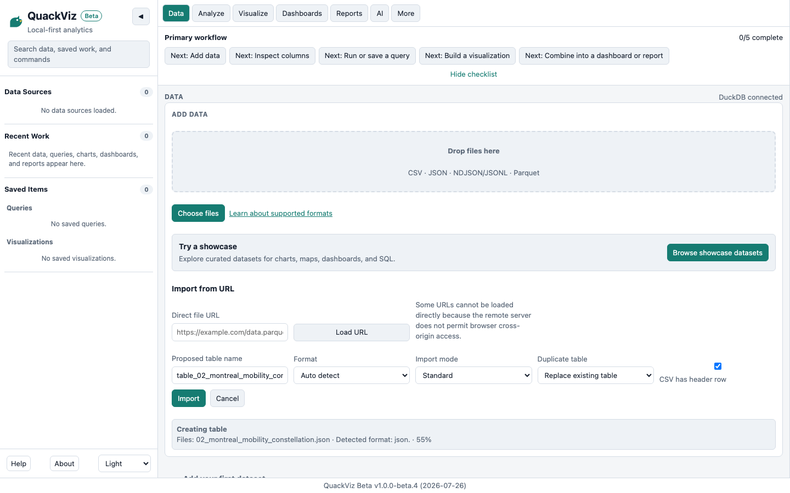
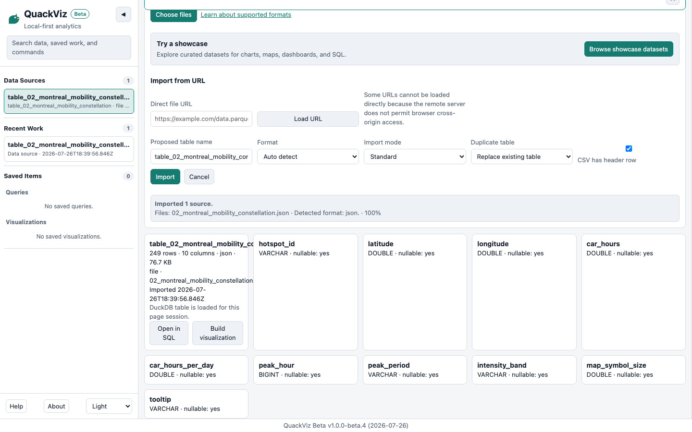
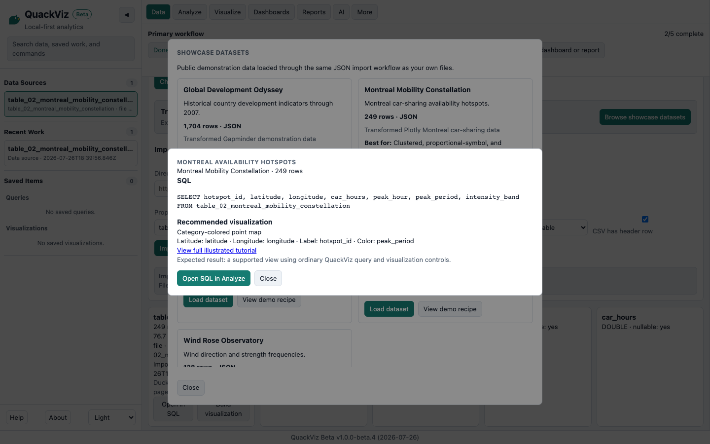
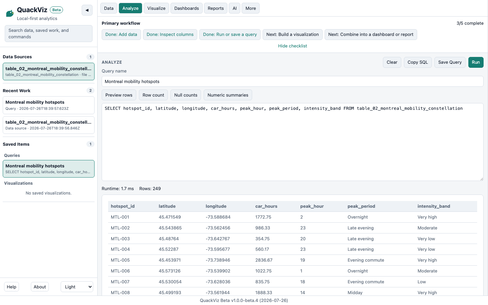
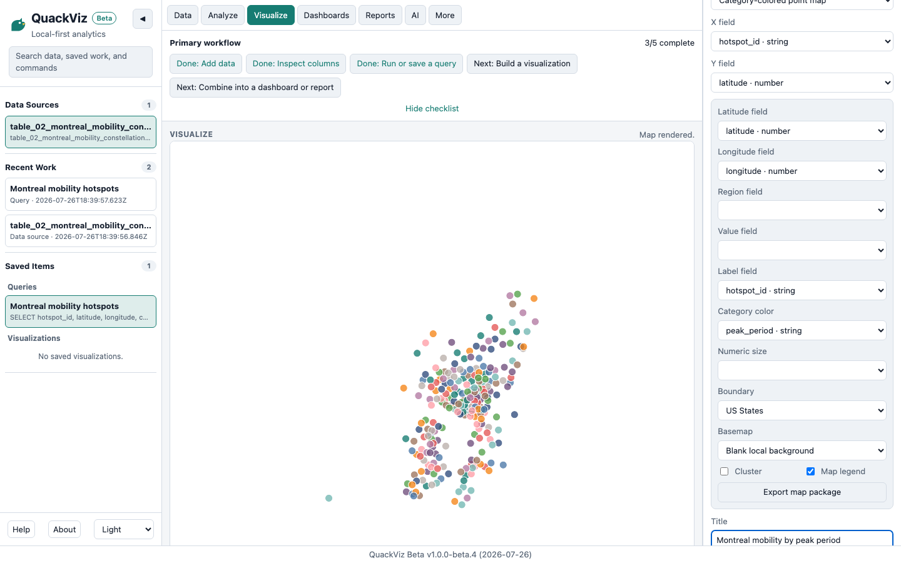
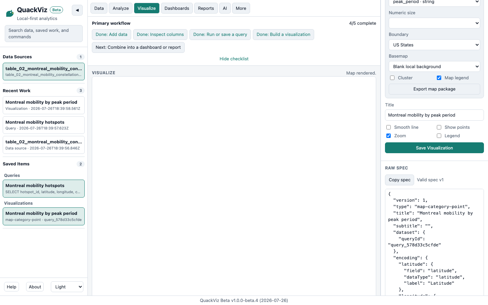
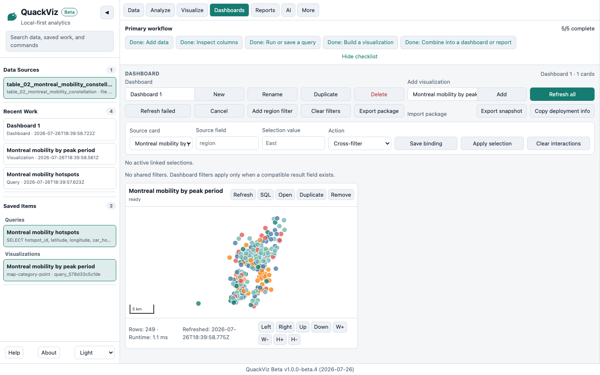

# Montreal Mobility Constellation

**Time:** about 5 minutes  
**Requires:** modern desktop browser  
**AI required:** No  
**Network required after page load:** No, using the local blank map

You will import JSON, run SQL, build a real map, save it, and place it on a dashboard.

## 1. Open Data

QuackViz runs locally in your browser. Showcase files use the same validated import path as your own JSON. From Data, choose **Browse showcase datasets**.



## 2. Choose Montreal Mobility Constellation

The 249-row dataset contains geographic car-sharing hotspot data suited to clustered, proportional-symbol, and category-colored point maps.



## 3. Load the dataset

Choose **Load dataset**. QuackViz detects JSON, proposes the safe table name `table_02_montreal_mobility_constellation`, and imports through DuckDB-WASM with the normal status and cleanup behavior.



## 4. Inspect imported data

Confirm 249 rows and review `hotspot_id`, `latitude`, `longitude`, `car_hours`, `peak_hour`, `peak_period`, and `intensity_band`.



## 5. Open the map recipe

The recipe provides visible, editable SQL:

```sql
SELECT
  hotspot_id,
  latitude,
  longitude,
  car_hours,
  peak_hour,
  peak_period,
  intensity_band
FROM table_02_montreal_mobility_constellation;
```



## 6. Run the query

Save the query, then run it. DuckDB-WASM executes locally and returns 249 rows.



## 7. Configure the map

Use these existing controls:

```text
Map type: Category-colored point map
Latitude: latitude
Longitude: longitude
Label: hotspot_id
Category: peak_period
Basemap: Blank local background
```

For a proportional-symbol alternative, select that map type and use `car_hours` as Numeric size.



## 8. Render the map

MapLibre renders the 249 local features without a Mapbox token. The blank background avoids remote tile requests.


## 9. Save the visualization

Name and save the visualization. Its metadata persists in the workspace; after reload, the local source file may need to be re-imported.



## 10. Add it to a dashboard

Create a dashboard, add the saved map, and refresh it. Use **More → Export workspace package** to create a local backup.



## Regenerating these images

From the repository root, run:

```sh
npm run docs:screenshots
```

The script starts a local static server, clears its isolated browser profile, imports through the normal showcase UI, verifies real DuckDB and MapLibre state, and writes intentional documentation assets under `docs/images/tutorials/montreal/`. Playwright failure artifacts remain under ignored test-result directories.
